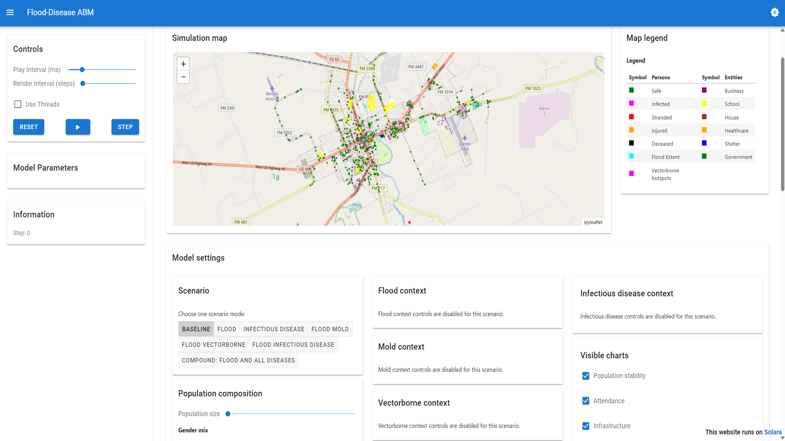
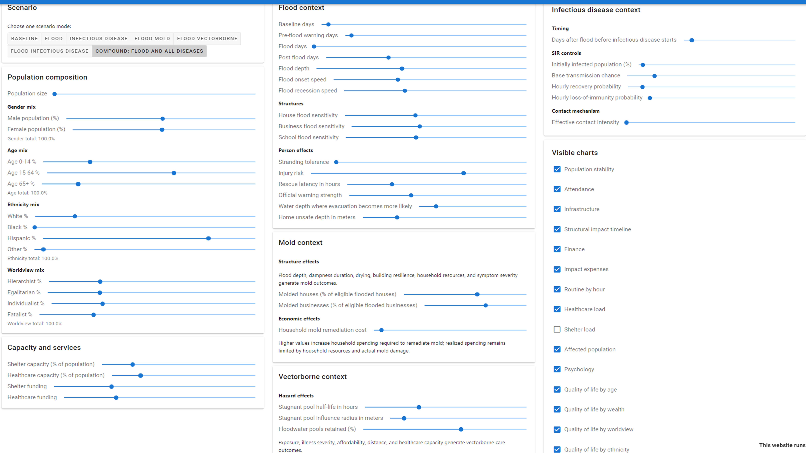

# Flood-Disease ABM: A multi-pathway flood-disease agent-based model for simulating health impacts across the disaster lifecycle

An agent-based model of how flooding, infectious disease, mold, vectorborne
disease, households, public services, and the local economy interact across a
disaster lifecycle. The current model runs on a Uvalde, Texas study area using
Mesa, Mesa-Geo, and Solara.

## Quick Start

Install the dependencies, then follow the instructions for your platform.
Run the commands from the project root.

### 1. Install

Install Python, then create the project environment and install the pinned
dependencies:

```powershell
python -m venv .venv
.\.venv\Scripts\python.exe -m pip install --upgrade pip
.\.venv\Scripts\python.exe -m pip install -r requirements.txt
```

### Linux or macOS

Create and activate the environment, install the pinned dependencies, and start
the interactive app:

```bash
python3 -m venv .venv
source .venv/bin/activate
python -m pip install -r requirements.txt
python -m solara run run/serverrun.py
```

The convenience script `scripts/setup_lab_env.sh` performs the environment
setup on Linux or macOS. The PowerShell start/stop helpers are Windows-only.

### 2. Start the interactive app on Windows

```powershell
.\start_serverrun.ps1
```

The helper starts Solara at <http://127.0.0.1:8766> and opens the browser.
The checked-in Uvalde spatial data is loaded automatically; no map selection
is required.

Stop the app when you are finished:

```powershell
.\stop_serverrun.ps1
```

### 3. Run a batch scenario

Use the project environment so the installed dependencies are used:

```powershell
.\.venv\Scripts\python.exe run\full_compound.py --persons 300 --replications 10
```

Results are written under `outputs/`. Use `--help` on any runner to see its
options.

## Interactive Application

The app shows the Uvalde map, agent movement, flood extent, health states,
service locations, and live charts. Use the scenario selector to explore the
available flood and disease combinations, then adjust population, timing,
service, hazard, and policy controls.

### Application overview



### Scenario and model controls



## Scenarios

The batch runners and interactive app share the same scenario definitions:

| Scenario | Processes enabled |
| --- | --- |
| `baseline` | None |
| `flood_only` | Flood |
| `infectious_disease` | Infectious disease |
| `flood_mold` | Flood and mold |
| `flood_vectorborne` | Flood and vectorborne disease |
| `flood_infectious` | Flood and infectious disease |
| `flood_mold_vectorborne` | Flood, mold, and vectorborne disease |
| `full_compound` | Flood, mold, vectorborne disease, and infectious disease |

Run any scenario directly:

```powershell
.\.venv\Scripts\python.exe run\baseline.py --persons 300 --replications 10
.\.venv\Scripts\python.exe run\flood_only.py --persons 300 --replications 10
.\.venv\Scripts\python.exe run\infectious_disease.py --persons 300 --replications 10
.\.venv\Scripts\python.exe run\flood_mold.py --persons 300 --replications 10
.\.venv\Scripts\python.exe run\flood_vectorborne.py --persons 300 --replications 10
.\.venv\Scripts\python.exe run\flood_infectious.py --persons 300 --replications 10
.\.venv\Scripts\python.exe run\flood_mold_vectorborne.py --persons 300 --replications 10
.\.venv\Scripts\python.exe run\full_compound.py --persons 300 --replications 10
```

Common runner options include `--persons`, `--replications`, `--workers`,
`--seed-base`, `--out-dir`, and `--keep-rep-folders`. All runs currently use
Uvalde; `--map uvalde` is accepted only for compatibility.

## Results and Analysis

Scenario outputs are generated under `outputs/` and are intentionally ignored
by Git. Analysis scripts in `analysis/` generate graphs from those exports. To
generate the paper figures from existing outputs:

```powershell
.\.venv\Scripts\python.exe analysis\graph_generation_for_paper\generate_paper_graphs.py
```

See [`analysis/graph_generation_for_paper/README.md`](analysis/graph_generation_for_paper/README.md)
for figure-selection and formatting options.

## Spatial Data

The active flood layer is
`space/Uvalde_TX_map_data/uvalde_twdb_scenario5_1in100_flood.geojson`.
Processed place data is stored in
`space/Uvalde_TX_map_data/processed/abm_places.gpkg`. See
[`space/Uvalde_TX_map_data/README.md`](space/Uvalde_TX_map_data/README.md) for
data provenance and optional rebuilding steps.

## More Documentation

- [`docs/scenario_default_tables.md`](docs/scenario_default_tables.md): source-keyed model defaults and scenario flags.
- [`docs/ORCHESTRATION.md`](docs/ORCHESTRATION.md): local batch execution and optional remote HPC workflow.
- [`config/defaults.py`](config/defaults.py): source of truth for shared defaults.

## License

This project is licensed under the MIT License. See [`license.txt`](license.txt)
for details.
